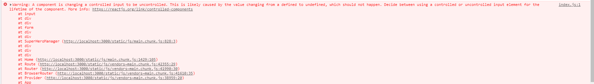

# Ejercicio Clase 03

## Ejecutar con npm start

Preview:

## Duda:

Se muestra el siguiente error por consola pero no sé cuales son las razones, la aplicación funciona igual a pesar del error.

Error:

Fernando Pérez