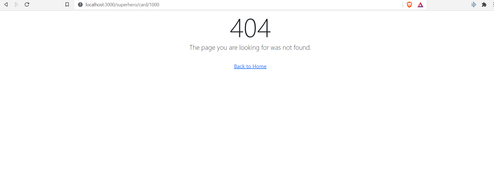

# Ejercicio Clase 04

## Ejecutar api-mock
https://github.com/docentedev/api-mock en puerto 4000

## Ejecutar con npm start

Preview:

## Probar siguiente caso

Preview 404:
http://localhost:3000/superhero/card/1000

Fernando Pérez